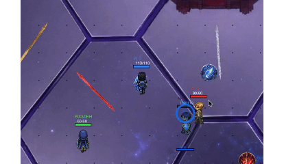
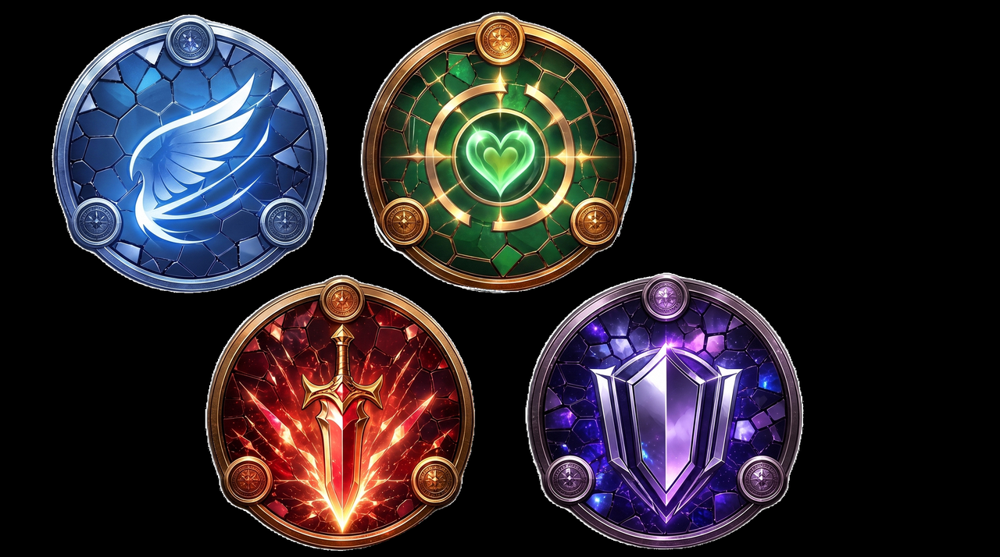
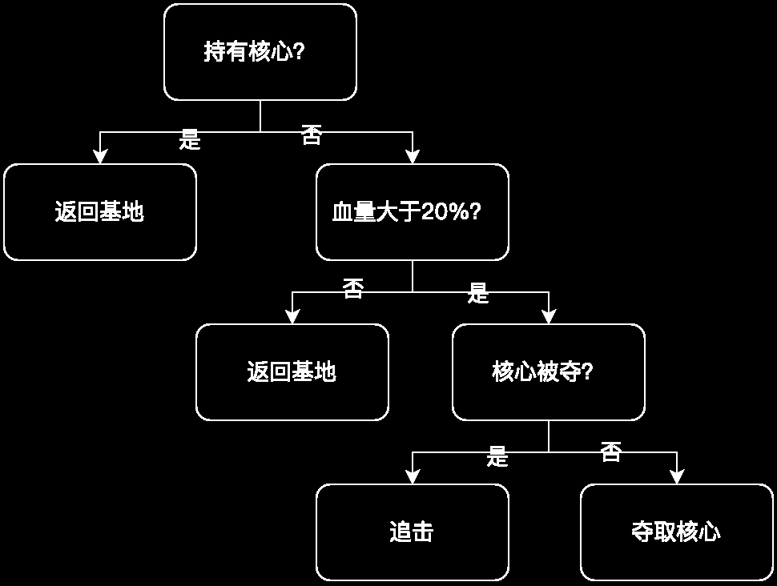
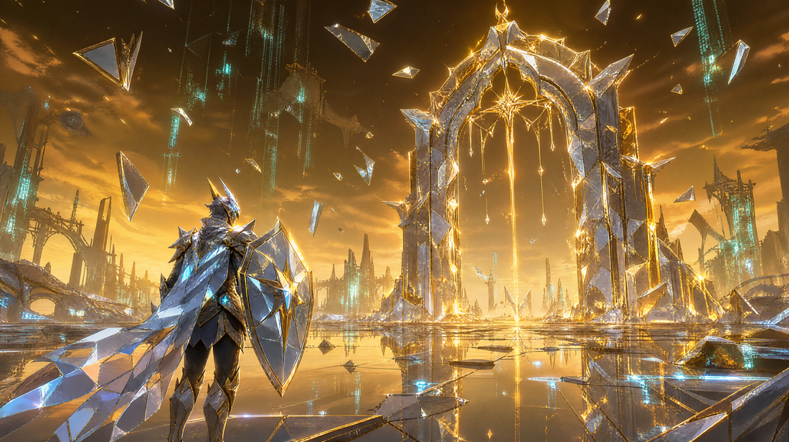
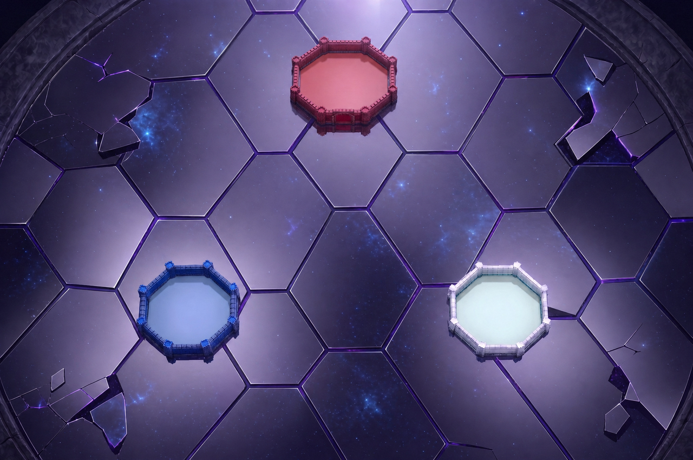
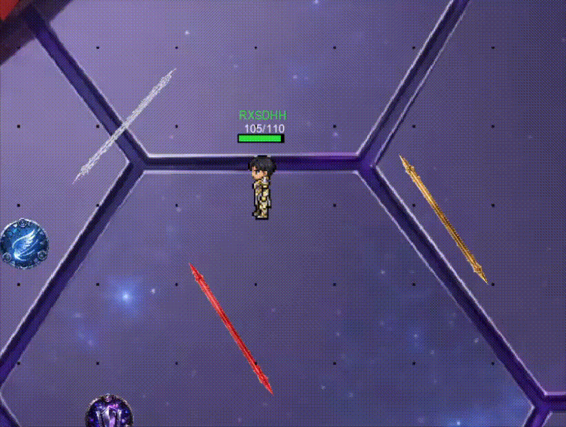

# 🎮 游戏策划作品集 | Game Design Portfolio

> 摆瑞何 ｜ 北京大学元培学院 · 金融学 ｜ 求职方向：游戏策划（活动策划 / 系统策划 / 数值策划）
> 联系方式：15810638715 ｜ ruihebai@163.com

---

## 🪞 《镜界行者》Mirror — 主作品

**2D 顶视角反射射击 ｜ 多人对抗 ｜ Godot 引擎 ｜ 独立完成（主策划 + 程序 + 制作）**

一个玩法概念：**所有子弹都会被镜面反弹——你的护盾同时也是敌人的武器。**

### 核心系统设计

- **镜面 × 能量耦合**：镜面同时充当生命值与攻防资源——攻击镜面即削减防御，
  形成"攻防同源"的资源博弈，配套夺核胜利条件（3 处核心 + 基地围墙 + 特殊威慑），
  构成完整单局节奏与翻盘空间。
- **元素克制体系**：风 / 雷 / 火 / 冰四种元素构成环形克制关系，
  决定角色定位与对局博弈维度。

### 数值设计与平衡验证

- 仿 MOBA 帽架搭建 **6 角色数值体系**（覆盖 HP / 移速 / 射速 / 伤害 / 射程 / 技能冷却 /
  完美反射 Buff 等 8 个维度），对应均衡 / 突击 / 射手 / 坦克 / 狙击 / 战士 6 种定位。
- **百局自动对局验证**：搭建 AI 自动对战与道具测试工具，跑通百局对战数据，
  采集命中率、K/D、伤害、承伤、夺核、存活时长 6 项指标定位失衡角色，
  再以真人对局完成验证迭代。

### AI 行为设计

针对 NPC「站桩 / 乱瞄」缺乏博弈感的问题，设计**参数化行为树**
（按位置 / 血量切换策略），建立「感知 → 决策 → 执行 → 复盘」闭环，
实现「抢核优先于战斗」的战术优先级。

### 画面与原画（AI 辅助生产管线）

使用 5 个 AI 工具协同完成单人产能放大至团队级：
代码（WorkBuddy）/ 美术（HoloPix）/ 音乐音效（MiniMax）/ 动画 / 图像，引擎 Godot / GDScript。

| 实机截图 | 实机截图 |
|---|---|
|  |  |

---

## 💣 《暗区摸金 · 撤离》— 网页原型（可在线试玩）

**搜打撤玩法原型 ｜ 策划 / 开发 ｜ HTML5**

把"搜打撤"核心乐趣拆解为可玩原型：搜索打辙 / 核心乐趣 → 设计警戒或欲望与暴富资源联动
——警戒越高越易触发埋伏掉血、血量越低撤离越易被蹲，使「贪欲的代价」立体化。

- 配套**五档物资体系**（绿 30% / 蓝 20% / 紫 20% / 金 15% / 红 4% / 机密文件 1%），
  价值比约 1 : 5 : 25 : 100 : 500
- 「追击或放弃」实时风险决策链

**▶ 在线试玩：[点击进入 Demo](demos/anqu-mojin.html)**（GitHub Pages 托管）

---

## 📦 游戏下载

| 平台 | 下载 |
|---|---|
| Windows | [MirrorWarrior.exe（Release 下载）](../../releases) |
| macOS | [mirror-walker-macos.zip（Release 下载）](../../releases) |

---

## 🧰 技能

- **策划工具**：Excel 数值建模与平衡测算、脑图 / 流程图、玩法原型搭建
- **引擎与开发**：Godot / GDScript（可独立完成可玩 Demo）、Unity（了解）
- **数据与 AI**：SQL / Stata / Wind / iFinD；多智能体协同工作流搭建（覆盖代码 / 美术 / 音效 / 动效全管线）

---

*本作品集持续更新中。*
